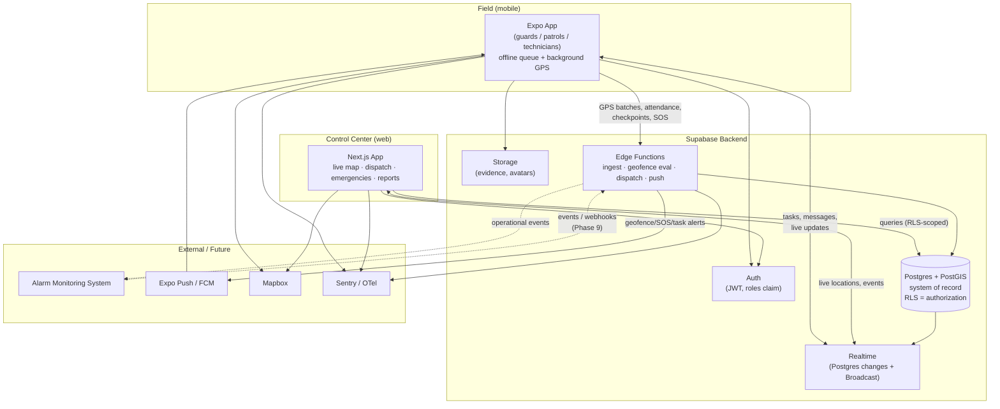

# 01 — System Architecture

## 1. Overview

Sentinel is a three-surface system over a single Supabase backend:

1. **Mobile app** (Expo/React Native) — carried by field staff. Emits GPS,
   handles attendance, patrols, tasks, comms, and SOS. **Offline-first.**
2. **Web control center** (Next.js) — the operators' cockpit. Live map, staff
   status, dispatch, emergencies, reporting.
3. **Supabase backend** — Postgres/PostGIS (system of record + authorization via
   RLS), Auth, Realtime (live map & events), Storage (media/evidence), and Edge
   Functions (privileged/server-side logic).

The **alarm-monitoring system stays external** and integrates later through a
loosely-coupled event/API boundary (see
[07-integration-boundary.md](07-integration-boundary.md)).

## 2. Component diagram



## 3. Key data flows

### 3.1 Location (hot path)

```
Device (background GPS, batched every 10–30s)
   → Edge Function `ingest-locations`
        → INSERT into location_pings   (append-only firehose, partitioned)
        → UPSERT current_location      (one row per employee → live map)
        → geofence evaluation (PostGIS) → geofence_events (+ alerts)
   → Realtime broadcasts current_location changes → control-center map
```

Why an Edge Function and not a direct table insert from the device? So the
*server* is the authority for geofence evaluation, spoof detection, and shift
validation — a device cannot be trusted to self-report those. See
[04-gps-pipeline.md](04-gps-pipeline.md).

### 3.2 Command/query (warm path)

Attendance, tasks, patrols, messages, incidents: the mobile & web clients read
and write through the Supabase client (PostgREST), **always constrained by RLS**.
No client can read or write rows its role/assignment does not permit.

### 3.3 Realtime fan-out

- **Live map**: control center subscribes to `current_location` changes.
- **Events**: geofence enter/exit, SOS, new tasks, messages → Realtime channels,
  reinforced by push notifications when the app is backgrounded.

## 4. Deployment topology

| Component | Host | Notes |
|---|---|---|
| Web app | Vercel | SSR + server actions; Edge/Node runtime |
| Mobile app | EAS Build → App Store / Play | OTA updates via Expo |
| Database + Auth + Realtime + Storage | Supabase | Pro plan before real GPS load |
| Edge Functions | Supabase | Deno runtime, deployed via CLI/CI |
| CI/CD | GitHub Actions | lint, typecheck, test, migrations, deploy |
| Errors/telemetry | Sentry | web, mobile, and functions |

## 5. Environments

Three logical environments — `local`, `staging`, `production` — each a distinct
Supabase project + Vercel deployment. Database changes flow **only** through
migrations in [`supabase/migrations/`](../supabase/migrations) (never hand-edited
in the dashboard), giving reproducible, reviewable schema changes.

## 6. Cross-cutting concerns

- **Authorization** → Postgres RLS (single source of truth). [03](03-rbac-rls.md)
- **Auditability** → `audit_log`, written by triggers/functions on sensitive
  mutations. [02](02-data-model.md), [03](03-rbac-rls.md)
- **Offline resilience** → device-side durable queue. [06](06-offline-sync.md)
- **Observability** → Sentry + structured logs; OTel-compatible span naming.
- **Secrets** → env vars per surface; `service_role` key only in Edge Functions /
  server code, never in a client bundle.
- **i18n** → `next-intl` (web) / `i18next` (mobile); `en` catalog only for now.
