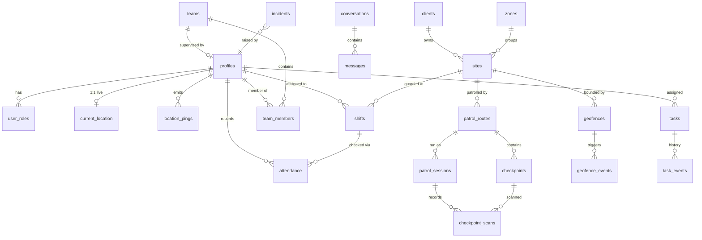

# 02 — Data Model

The canonical, executable form of this model lives in
[`supabase/migrations/`](../supabase/migrations). This document explains the
*shape* and the *why*. Everything is single-tenant (see
[ADR-0002](adr/0002-single-tenant.md)); there is no `tenant_id` on tables.

## 1. Entity map

## 2. Domains

### 2.1 Identity & roles
- **`profiles`** — 1:1 with `auth.users`. Employee record: name, phone,
  `employee_code`, `employment_type` (guard/patrol/technician/office),
  `status`, avatar.
- **`app_role`** (enum) — `super_admin`, `control_operator`, `dispatcher`,
  `supervisor`, `guard`, `patrol`, `technician`.
- **`user_roles`** — a user may hold several roles. This table (not a column on
  `profiles`) is what RLS reads. See [03](03-rbac-rls.md).

### 2.2 Clients, sites & geography
- **`clients`** — the security company's customers (site owners). Data only.
- **`sites`** — protected locations. `location geography(Point)`, address,
  optional `zone_id`.
- **`zones`** — geographic grouping (`geometry geography(Polygon)`), used for
  patrol areas and operator filtering.
- **`geofences`** — the authoritative boundary for a site (or standalone).
  Either a polygon (`area geography(Polygon)`) or a circle (`center` + `radius_m`).
  Geofence evaluation on the server uses PostGIS `ST_Covers` / `ST_DWithin`.

### 2.3 Workforce structure
- **`teams`** + **`team_members`** — supervisor → team → members. Drives the
  "supervisor sees their team" RLS rule.
- **`vehicles`** — patrol vehicles (plate, type, status), assignable to shifts.

### 2.4 Shifts & assignment
- **`shifts`** — scheduled work: `employee_id`, target (`site_id` for static
  guards *or* `zone_id`/route for patrols), `starts_at`/`ends_at`, `status`.
  The shift is the context that authorizes on-site GPS + attendance.

### 2.5 GPS (see [ADR-0003](adr/0003-gps-data-model.md) & [04](04-gps-pipeline.md))
Three tiers, deliberately separated:

| Table | Cardinality | Purpose | Access pattern |
|---|---|---|---|
| **`location_pings`** | millions, append-only, **partitioned by month** | raw firehose / history | inserted by ingest fn; read for trails |
| **`current_location`** | **1 row per employee** (upsert) | the live map | subscribed via Realtime |
| **`geofence_events`** | one per enter/exit | alerts + audit | read by operators |

`current_location` being tiny is what keeps the live map fast and Realtime cheap.
`location_pings` being partitioned is what keeps writes/retention manageable.

### 2.6 Attendance
- **`attendance`** — check-in/out against a shift: timestamps, capture location,
  `method` (gps_geofence / manual / qr / nfc), verification `status`.

### 2.7 Patrols
- **`patrol_routes`** → ordered **`checkpoints`** (NFC/QR/geofence, with
  location). A run is a **`patrol_session`**; each scan is a
  **`checkpoint_scan`** (records time, location, method, and whether it was
  in-geofence).

### 2.8 Tasks / dispatch
- **`tasks`** — dispatched work: `type`, `priority`, `status`, `assigned_to`,
  optional `site_id`, `created_by`, `due_at`, description, geo.
- **`task_events`** — immutable status/assignment history.

### 2.9 Communication
- **`conversations`** + **`conversation_members`** + **`messages`** — direct and
  group messaging between control center and field. (Schema stubbed in Phase 0,
  built in Phase 6.)

### 2.10 Emergency
- **`incidents`** — SOS/panic and operator-raised incidents: `type`, `status`,
  raised_by, location, `acknowledged_by`/`acknowledged_at`, resolution.

### 2.11 Audit
- **`audit_log`** — append-only: `actor_id`, `action`, `entity_type`,
  `entity_id`, `before`/`after` (jsonb), `at`, `ip`. Written by DB triggers on
  sensitive tables and by Edge Functions for privileged actions.

## 3. Conventions

- **PKs**: `uuid` default `gen_random_uuid()`.
- **Timestamps**: `timestamptz`, `created_at`/`updated_at` on mutable tables;
  `updated_at` maintained by a shared trigger.
- **Soft delete**: `deleted_at timestamptz` on business entities (hard deletes
  are prohibited actions; retention/rollup handles GPS).
- **Geo**: `geography(Point/Polygon, 4326)` (WGS84) with GiST indexes.
- **Enums**: Postgres enum types for stable vocabularies (roles, statuses).
- **Money/precision**: none expected in scope; distances in meters.
- **Naming**: `snake_case`, plural tables, `*_id` FKs, `is_*`/`has_*` booleans.

## 4. Retention

- `location_pings` partitions older than **90 days** are rolled up into a
  downsampled `location_history` (1 pt / 5 min) and dropped. Tunable per legal /
  contractual requirements. Documented in [04](04-gps-pipeline.md).
