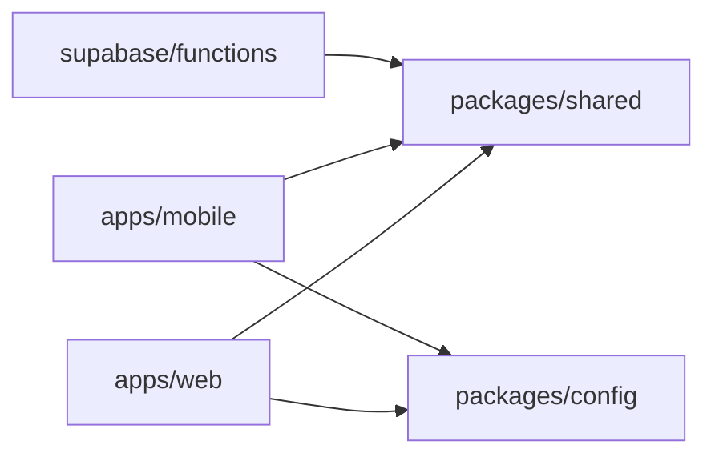

# 05 — Repository Structure

A **pnpm + Turborepo monorepo** (see [ADR-0005](adr/0005-monorepo.md)). One
place for shared types and schemas so web, mobile, and DB never drift.

```
sentinel/
├── apps/
│   ├── web/                 # Next.js control center (Phase 1+)
│   │   ├── app/             #   App Router
│   │   ├── components/      #   shadcn/ui-based
│   │   └── lib/
│   └── mobile/              # Expo field app (Phase 1+)
│       ├── app/             #   expo-router
│       ├── components/
│       └── lib/
├── packages/
│   ├── shared/              # Cross-platform TS: types, Zod schemas, constants
│   │   ├── src/
│   │   │   ├── types/       #   incl. generated Supabase types (db.types.ts)
│   │   │   ├── schemas/     #   Zod validators shared by client + server
│   │   │   └── supabase/    #   typed client factory
│   ├── config/              # Shared eslint/tsconfig/prettier/tailwind presets
│   └── ui/                  # (optional) shared design tokens
├── supabase/
│   ├── migrations/          # Ordered SQL — the schema + RLS (Phase 0)
│   ├── functions/           # Edge Functions (Deno) — ingest, dispatch, push
│   ├── config.toml          # Supabase CLI project config
│   └── seed.sql             # Local dev seed data
├── docs/                    # This blueprint + ADRs
├── .github/workflows/       # CI/CD
├── package.json             # Workspace root
├── pnpm-workspace.yaml
├── turbo.json
└── .env.example
```

## Conventions

- **Language**: TypeScript everywhere (strict). SQL for schema. Deno/TS for Edge
  Functions.
- **Shared types**: `packages/shared` is the only source of domain types and Zod
  schemas. Supabase-generated DB types live there too (`pnpm db:types`).
- **Validation**: one Zod schema per payload, imported by both the client (form
  validation) and the Edge Function (server validation). Never validate twice
  with two definitions.
- **Imports**: workspace packages referenced as `@sentinel/shared`,
  `@sentinel/config`, etc.
- **Lint/format**: shared ESLint + Prettier presets from `packages/config`.
- **Commits**: Conventional Commits; PRs must pass `lint`, `typecheck`, `test`,
  and migration checks.
- **Migrations**: additive, ordered, reviewed. The database is changed *only*
  through files in `supabase/migrations/` — never edited by hand in the
  dashboard.
- **No secrets in the repo**: only `.env.example`. Real values via env / CI
  secrets.

## Package boundaries



`shared` depends on nothing app-specific, so it is safe to import from web,
mobile, and Edge Functions alike.
