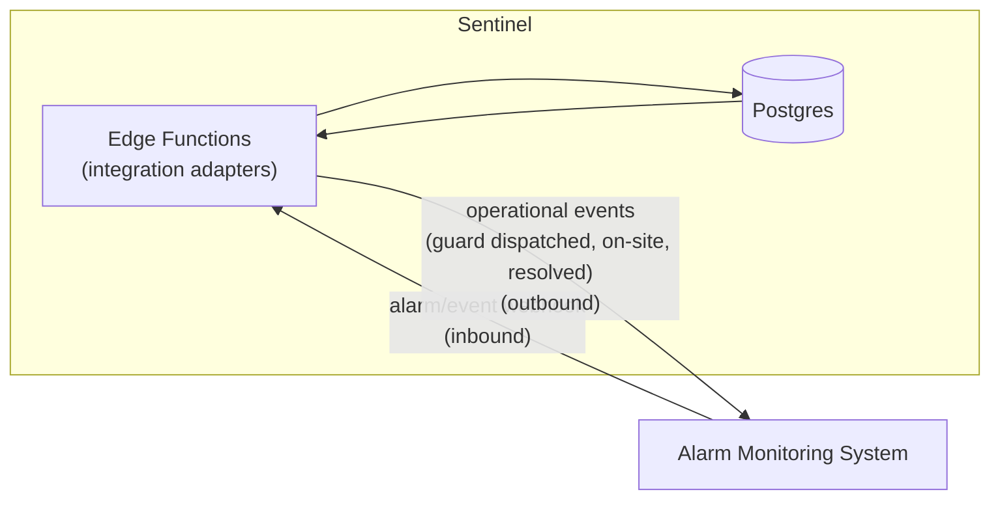

# 07 — Integration Boundary

## 1. Principle

Sentinel is the **operational workforce layer**. The existing **alarm-monitoring
system** stays the system of record for alarm reception and monitoring. The two
integrate through a **loosely-coupled, event-driven boundary** — never a shared
database, never tight synchronous coupling. Either system must be able to evolve
or be temporarily unavailable without breaking the other.

## 2. Inbound (alarm system → Sentinel) — Phase 9

- Alarm system posts events to a **versioned webhook** exposed by an Edge
  Function (`integrations/alarm-inbound`).
- Events are **authenticated** (signed secret / mTLS) and **verified**, then
  written to an `integration_events` inbox table (append-only) before processing
  — so nothing is lost if downstream processing fails.
- Example: an alarm at a site can auto-create a dispatch task for the nearest
  available patrol.

## 3. Outbound (Sentinel → alarm system) — Phase 9

- Operational milestones (task acknowledged, guard on-site, incident resolved)
  are published as events to the alarm system's API.
- Delivery uses an **outbox pattern**: events written transactionally to an
  `integration_outbox`, delivered by a worker with retries + dead-lettering.

## 4. Contracts

- All integration payloads have **explicit, versioned schemas** (Zod in
  `packages/shared`, mirrored in a published contract doc).
- Idempotency keys on every event so redelivery is safe.
- No PII beyond what the integration strictly requires.

## 5. Why not sooner

Phases 0–8 deliberately build Sentinel as a *self-contained* system. The
integration boundary is designed now (this doc) but implemented in **Phase 9**,
so the core platform is proven before coupling to an external system. The
outbox/inbox tables can be added when Phase 9 begins without reshaping existing
data.

## 6. Other future integrations

The same event-driven adapter pattern covers HR/payroll (shift/attendance
export), BI/reporting warehouses, and SSO — each as an isolated adapter, none in
the critical path of field operations.
